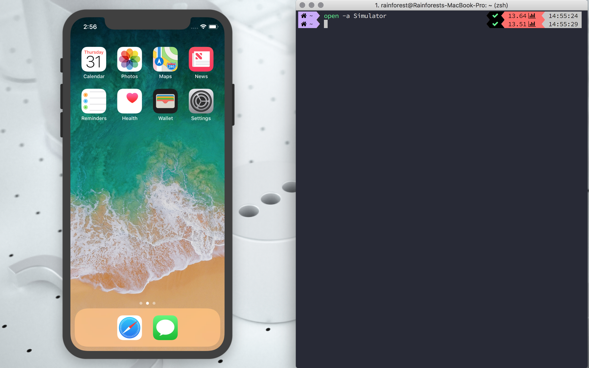
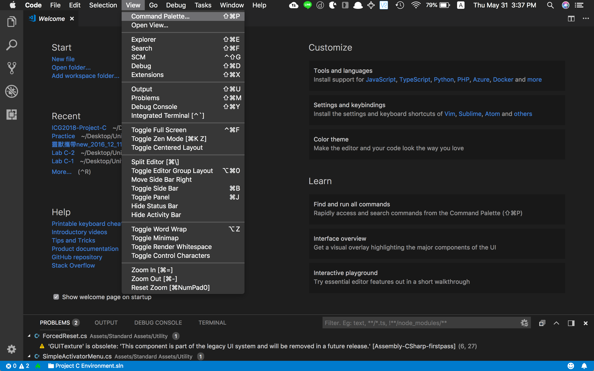
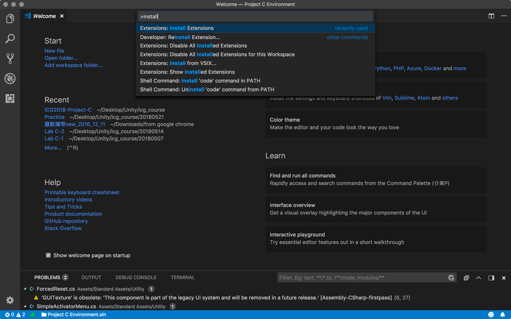
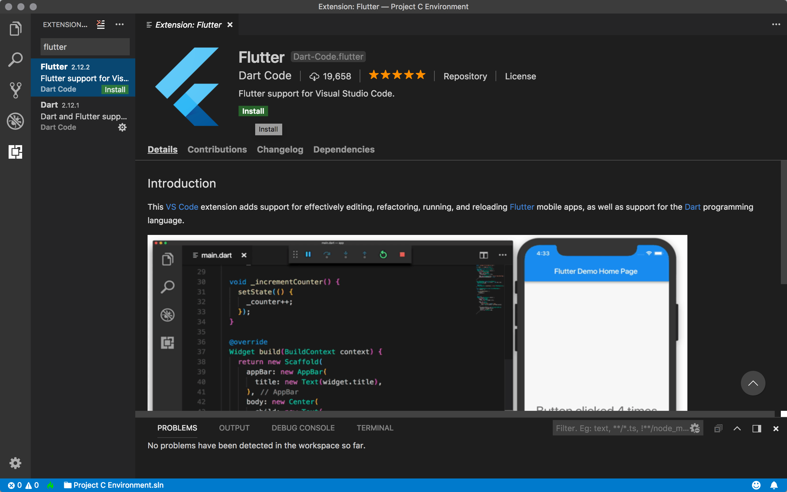
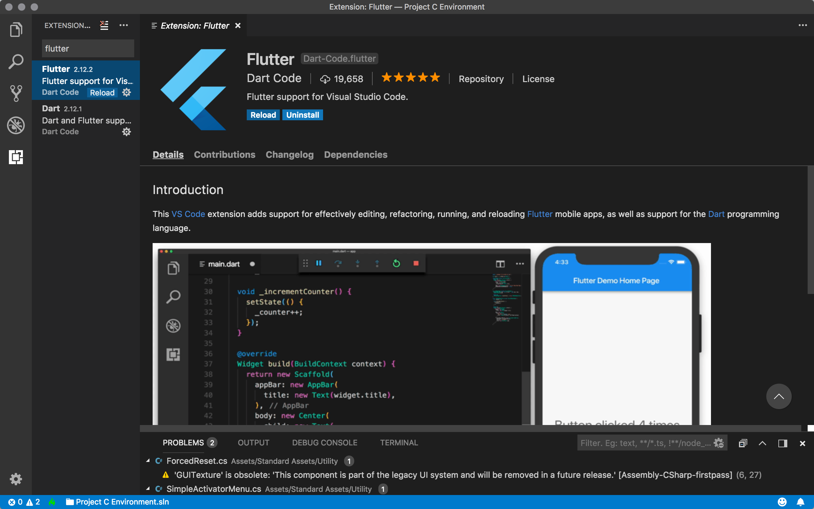
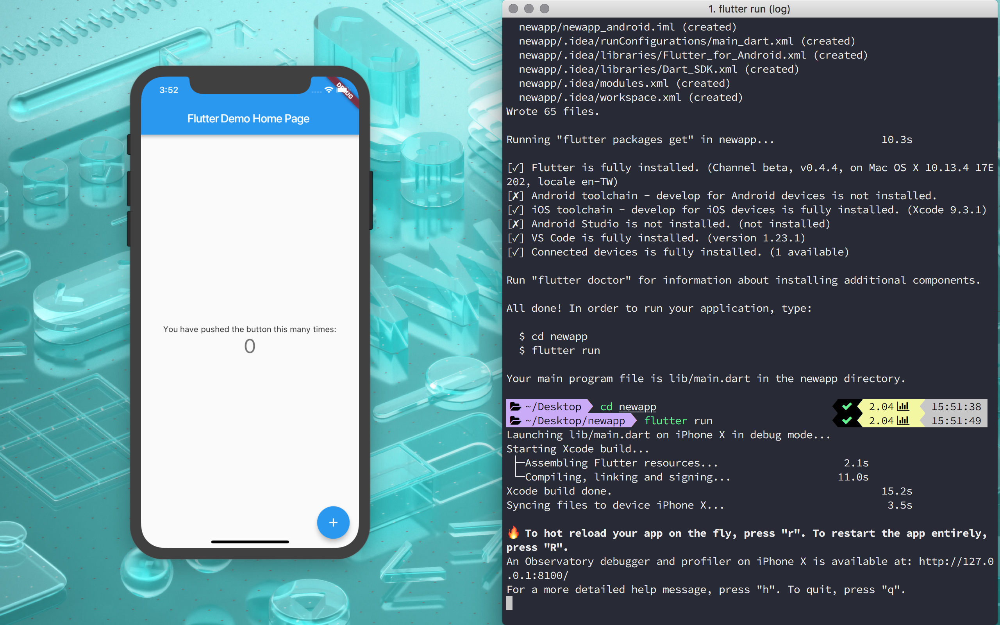
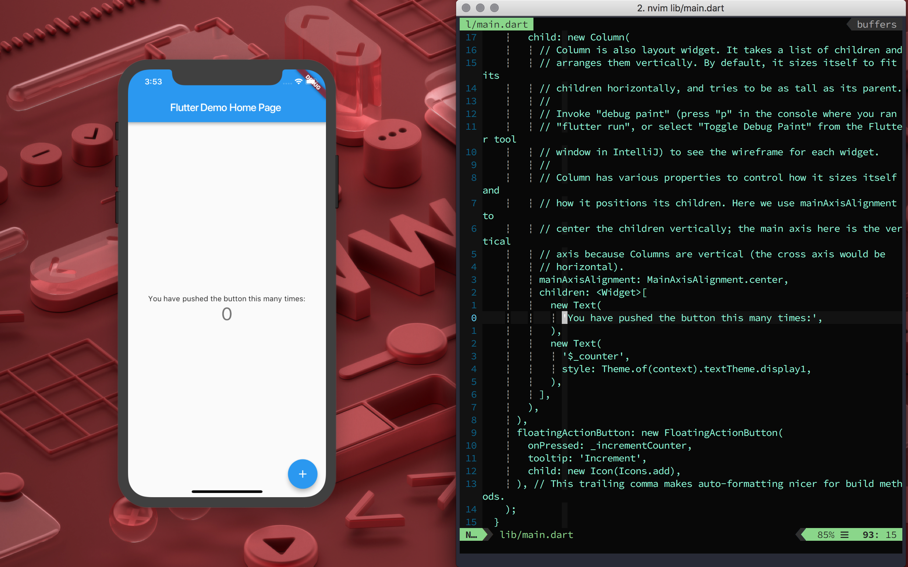
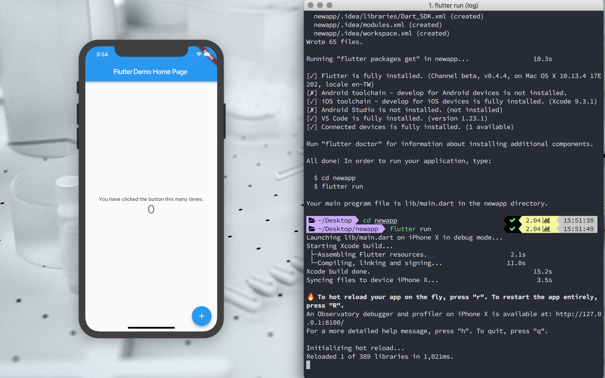

# Flutter


## System Requirements

* Operating Systems: macOS(64-bit)
* Disk Space: 700 MB $\uparrow$ (does not include disk space for IDE/tools)
* Tools: ```bash```, ```mkdir```, ```rm```, ```git```, ```curl```, ```unzip```, ```which```

## Installation

1. Download the latest release of the [Flutter SDK](https://flutter.io/sdk-archive/#macos)

2. Extract and move the file to the directory where you placed the Flutter SDK

   ```powershell
   # cd ~/Downloads
   # unzip ~/Downloads/flutter_macos_vx.x.x-beta.zip
   # for my mac, it will auto unzip the downloaded zip files
   mv ./flutter ~
   # place at the home
   ```

3. Update the path variable in ```.zshrc```

   * ```nvim ~/.zshrc```

   * ```
     # Flutter
     export PATH="/Users/your_user_name/flutter/bin:$PATH"
     ```

   * ```source .zshrc```

   * Run ```echo $PATH``` and check the ```flutter/bin``` directory is now in your PATH 

4. Run flutter doctor to see if there are any dependencies you need to install to complete the setup.

   ```powershell
   flutter doctor
   ```

   ```
   Doctor summary (to see all details, run flutter doctor -v):
   [✓] Flutter (Channel beta, v0.4.4, on Mac OS X 10.13.4 17E202, locale en-TW)
   [✗] Android toolchain - develop for Android devices
       ✗ Unable to locate Android SDK.
         Install Android Studio from: https://developer.android.com/studio/index.html
         On first launch it will assist you in installing the Android SDK components.
         (or visit https://flutter.io/setup/#android-setup for detailed instructions).
         If Android SDK has been installed to a custom location, set $ANDROID_HOME to that location.
   [!] iOS toolchain - develop for iOS devices (Xcode 9.3.1)
       ✗ libimobiledevice and ideviceinstaller are not installed. To install, run:
           brew install --HEAD libimobiledevice
           brew install ideviceinstaller
       ✗ ios-deploy not installed. To install:
           brew install ios-deploy
       ✗ CocoaPods not installed.
           CocoaPods is used to retrieve the iOS platform side's plugin code that responds to your plugin usage on the Dart side.
           Without resolving iOS dependencies with CocoaPods, plugins will not work on iOS.
           For more info, see https://flutter.io/platform-plugins
         To install:
           brew install cocoapods
           pod setup
   [✗] Android Studio (not installed)
   [!] VS Code (version 1.23.1)
   [!] Connected devices
       ! No devices available
   
   ! Doctor found issues in 5 categories.
   ```

### Platform setup

> macOS supports developing Flutter apps for both iOS and Android. Complete at least one of the two platform setup steps now, to be able to build and run your first Flutter app.

#### iOS setup

* Install Xcode $\rightarrow$ With Xcode, you’ll be able to run Flutter apps on an iOS device or on the simulator.

  1. Install Xcode 9.0 or newer(via [web download](https://developer.apple.com/xcode/) or the [Mac App Store](https://itunes.apple.com/us/app/xcode/id497799835))
  2. Configure the Xcode command-line tools to use the newly-installed version of Xcode by running ```sudo xcode-select --switch /Applications/Xcode.app/Contents/Developer``` from the command line
  3. Make sure the Xcode license agreement is signed by either opening Xcode once and confirming or running ```sudo xcodebuild -license``` from the command line

* Set up the iOS simulator

  1. On Mac, you can open the Simulator via type ```open -a Simulator``` in your terminal.

     

     * simulator's **Hardware > Device** menu $\rightarrow$ 64-bit device(iPhone 5s or later)
     * **Windows > Physical Size** can change the simulator size to fit the real size.

* Deploy to iOS devices

  * according to the ```flutter doctor``` results, you need to install the tools for deploying Flutter apps to iOS devices.

    1. Install [Homebrew🍺](https://docs.brew.sh/Installation).

    ```powershell
    brew update
    brew install --HEAD libimobiledevice
    brew install ideviceinstaller ios-deploy cocoapods
    pod setup # this command may take some time
    ```

    2. if any of these commands fails with an error, try ```brew doctor``` or god bless you XDD.

  * Here I meet an error that missing Xcode dependency - Python module **six**

    ```powershell
    brew reinstall python@2
    pip install six 
    ```

### Configure Editor

* You can simply use any text editor combined with command-line tools.

* Or, add an editor plugin for VS Code

  * Install VS Code via [Homebrew-Cask](https://caskroom.github.io/)

    ```powershell
    brew tap homebrew/cask
    brew cask search visual-studio-code
    brew cask info visual-studio-code
    brew cask install visual-studio-code
    ```

  * Install the Flutter plugin

    1. Start VS Code

    2. Invoke **View > Command Palette...** or type **⌘+⇪+P**

       

    3. Type 'install',and select the **Extensions: Install Extension** action

       

    4. Enter **flutter** in the search field, select ‘Flutter’ in the list, and click **Install**

       

    5. Select **reload** to reload VS Code

       

  * Validate your setup with the Flutter Doctor

    1. Invoke **View > Command Palette...** or type **⌘+⇪+P**
    2. Type 'doctor',and select the **Flutter: Run Flutter Doctor** action
    3. Review the output in the ‘OUTPUT’ pane for any issues

### Test Drive

* **Terminal + editor**

  * Create new app

    ```powershell
    cd Desktop
    flutter create newapp
    cd newapp
    ```

  * Run the app

    ```powershell
    flutter run
    ```

  

  * Try a hot reload

    1. ```nvim lib/main.dart```

    2. Try to change the string

       ```
       # 'You have pushed the button this many times:'
       'You have clicked the button this many times:'
       ```

    

    3. Press **r** to hot reload; press **R** to restart the app entirely. 

    


## References

1. [Build reactive mobile apps with Flutter (Google I/O '18)](https://www.youtube.com/watch?v=RS36gBEp8OI)
2. [Design - Material Design](https://material.io/design/)
3. [Get Started: Install on macOS - Flutter](https://flutter.io/setup-macos/)
4. [Get Started: Configure Editor - Flutter](https://flutter.io/get-started/editor/#vscode)
5. [Get Started: Test Drive - Flutter](https://flutter.io/get-started/test-drive/#terminal)
6. [Missing xcode dependency: Python module "six" · Issue #16428 · flutter/flutter](https://github.com/flutter/flutter/issues/16428)
7. [Write Your First Flutter App - Flutter](https://flutter.io/get-started/codelab/)
8. 